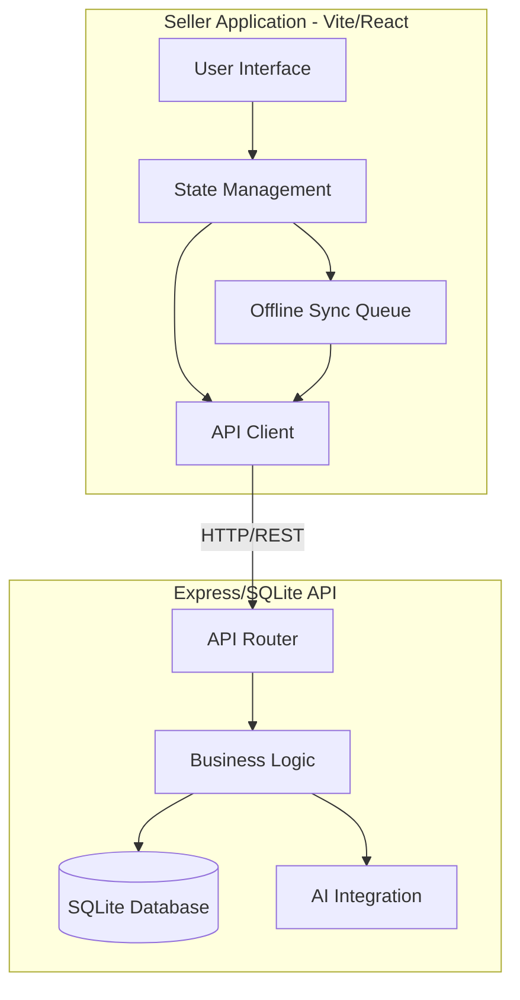
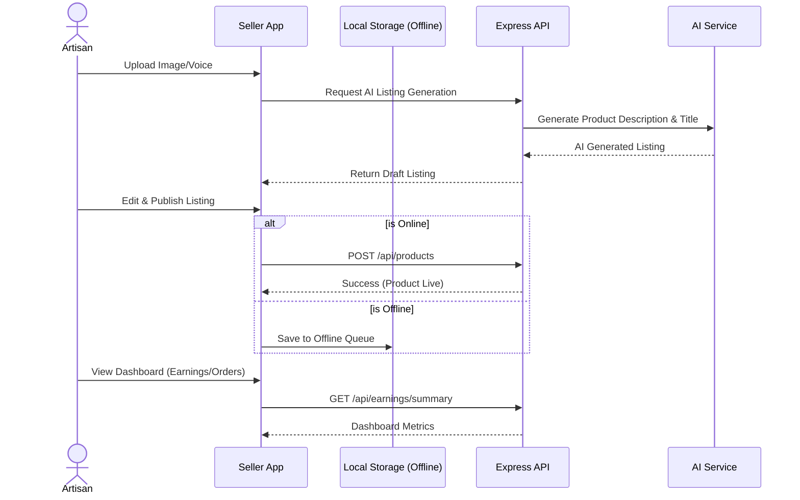
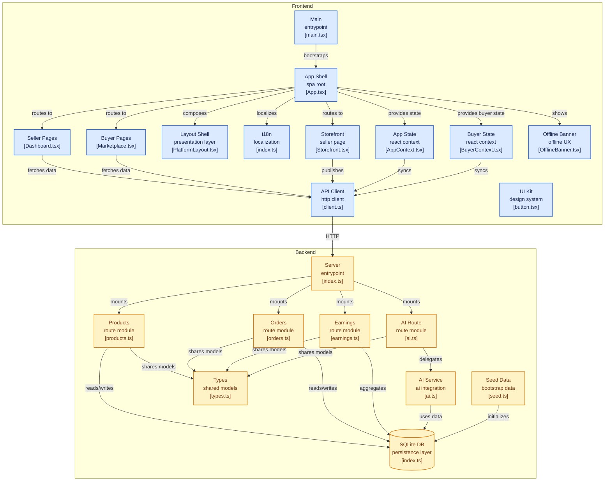

# ARTISYNK - Rural Women Artisan E-Commerce Platform

This repository contains the complete codebase for **ARTISYNK**, a platform designed to empower rural women artisans by providing them with an easy-to-use storefront, AI-assisted product listing, order tracking, and earnings dashboard.

## System Architecture

The project is split into a frontend application tailored for sellers and a backend API.



## User Workflow




## FRONTEND BACKEND CONNECTION 




## Folder Structure

- **`backend/`**: Express + SQLite REST API serving the seller app (and future buyer app).
- **`SELLER SIDE BASIC LOGIC/`**: Vite + React frontend application with multilingual support, offline sync, and an AI-driven product creation flow.

## Getting Started

### Run the entire stack:

Navigate to the seller directory:
```bash
cd "SELLER SIDE BASIC LOGIC"
npm install
npm run dev:all
```
*(This will install dependencies and concurrently start the backend API on port 3001 and frontend on port 5173).*
